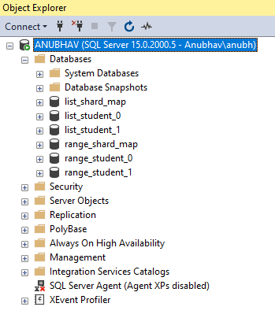

## Elastic scale with MS SQL Database

***How do you scale your database?***   
*One method could be to keep on increasing the machine capacity like RAM and CPU cores. But this is not enough in a highly scalable system.
At some point, you need to have multiple machines. This concept of having multiple machines is called as horizontal scaling. 
Each machine keeps a part of the database and that part is called as a shard.*

***How to use shard in your project?***  
*While there are a lot of theories on how to shard a database. Complex concepts like constiant hashing is a common one. Here we cover the most simple approach to shard database:* **Use shard map manager**

#### Shard Map manager
It is a database which keeps track that a perticualar record can be found in which database shard. Below is a simple diagram taken from [Microsoft documentation on database shards](https://learn.microsoft.com/en-us/azure/azure-sql/database/elastic-scale-shard-map-management?view=azuresql)

Here, the idea is that we have a database table which contains the information that which of the shards contain the full information of a record.  

There are two types of shard maps  
1. Range shard
2. List shard

Below is the detail on both: 

**1.Range Shard:**   Here we create shard range wise. Say id = [0,100) belongs to shard 1. id = [100,200) belongs to shard 2 and so on. If my range gets fulled, i create one more shard. In this way, as my data grows, i will keep on adding new shards.  

| key | Shard location  |
|--|--|
| [1, 50) | Database_A |
| [50, 100) | Database_B |
| [100, 200) | Database_C |
| [400, 600) | Database_C |
| ... | ... |

**2. List Shard:**   Here we have plane mapping of shard to id. This is used when you wish to keep segreation at a very high level. Say, all the data of customer 1 to be stored in the same shard. So, at such a high level, you can choose the point mapping. 

| key | Shard location  |
| -- | -- |
| 1  | Database_A |
| 3  | Database_B |
| 4  | Database_C |
| 6  | Database_B |
| ...  | ... |

#### Elastic scale Library
  The client diecides which shard to assign to which id. This is done using elastic scale library. 
Here is the github link to the source code: [elastic db tools for Azure SQL](https://github.com/Azure/elastic-db-tools). 
There is corresponsing Java implementation available as well. You can import the library using nuget as well as maven dependency.   
Here is microsoft doc on how to elastically scale your MS SQL database : [Microsoft Elastic scale](https://learn.microsoft.com/en-us/azure/azure-sql/database/elastic-scale-get-started?view=azuresql)
You can also read about database sharding on ms sql on this microsoft documentation [Scaling out with Azure SQL Database
](https://learn.microsoft.com/en-us/azure/azure-sql/database/elastic-scale-introduction?view=azuresql)

### How to run the code
1. You must of dotnet 7 installed.
2. Check the file:  [Constants.cs](ElasticScaleDemo/Helper/Constants.cs) and modify the value of server name. 
3. It is meant to run on local, to you need to install ms sql server on local. 

### Code explaination
The [Program.cs](ElasticScaleDemo/Program.cs) contains two flows:  Range Shard and list shard. You can see there are two functions which are called on by one. You can comment one and un comment other if you wish to see the behavours.
 
Below are the databases created:
 

